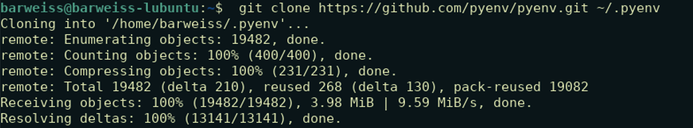

# Pyenv for Linux
| [Home](README.md) | [Pyenv for MacOS](pyenv-for-macos.md) | [Pyenv for Linux](pyenv-for-linux.md) | [Pyenv for Windows](pyenv-for-windows.md) |

Installing on Pyenv on a Linux distribution isn’t too different than how it is installed on MacOS. In fact you can use Homebrew to install Pyenv on Linux if you prefer; however, since we covered installing Pyenv with Homebrew in the MacOS section of this blog, we’ll demonstrate how to install Pyenv using git from Pyenv’s Github repository. 

1. Prior to starting your installation on your Linux platform (or MacOS if you want to use this method), you’ll want to ensure that git is installed on your system. If it your output comes back with an error, then you’ll want to ensure that it is installed. There are multiple ways of installing git on your system, see [the Git website](https://git-scm.com/book/en/v2/Getting-Started-Installing-Git) for more information.

    `git --version`

    

2. Ensure that you are in your **home** directory and create a folder named “.pyenv”.
   
   `cd ~ && mkdir ~/.pyenv`

    Then ensure that folder has been created.

    `ls -aol ~ | grep “.pyenv”`

    

3. Clone this pyenv repository from Github to your newly created .pyenv folder.

    `git clone https://github.com/pyenv/pyenv.git ~/.pyenv`

    

4. Just like the with the MacOS install  you will need to update you will want to add the following to the **.zshrc** or **.bashrc** file depending on what shell you use. See https://github.com/pyenv/pyenv for more information as there may be special exceptions.

    Use the command line editor of your choice (nano, vim, etc.) and then copy and paste the following where appropriate in the .zshrc/.bashrc file.
    ```
    # DEFINE ENVIRONMENTAL VARAILBLE TO POOINT TO THE PATH WHERE PYENV IS LOCATED
    # ADD THE $PYENV_ROOT/bin TO $PATH
    export PYENV_ROOT="$HOME/.pyenv"
    export PATH="$PYENV_ROOT/bin:$PATH"
    eval "$(pyenv init --path)"

    # ADD pyenv init TO YOUR SHELL TO ENABLE SHIMS AND AUTOCOMPLETION.
    if command -v pyenv 1>/dev/null 2>&1; then
      eval "$(pyenv init -)"
    fi
    ```
5. Restart your shell to reload your shell profile to start with the new commands.

    `exec $SHELL`

6. Verify that pyenv is installed by checking for the version.
   
   `pyenv --version`

    

    If you receive a similar output as above, then you should be able to use pyenv the same way as MacOS. Go back to the MacOS section to and start from [step 7](pyenv-for-macos.md#7). This will get you started with Pyenv.


