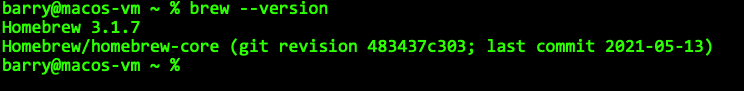
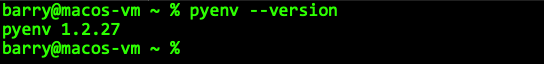
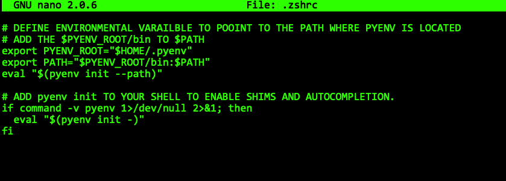
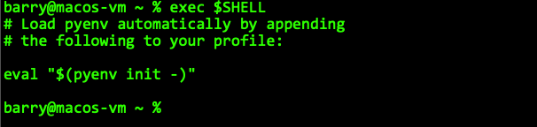
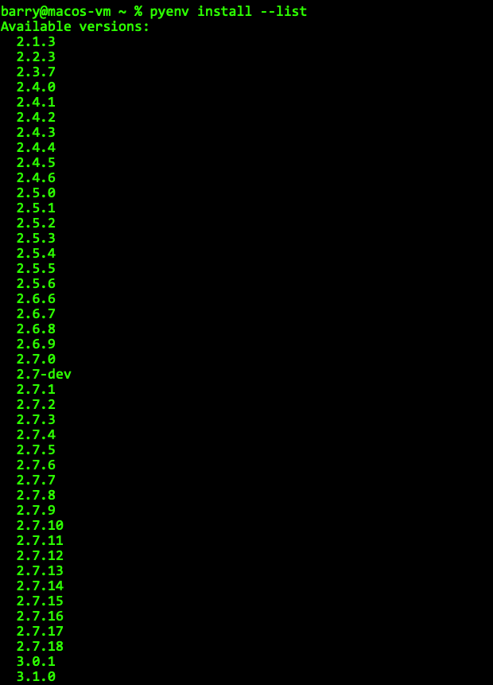
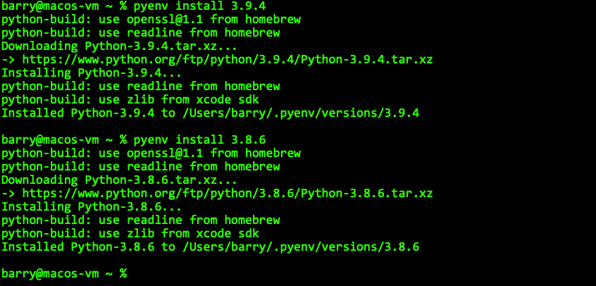
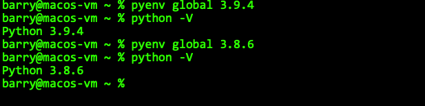
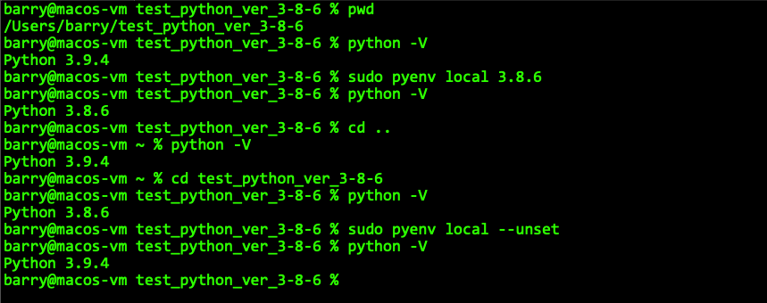
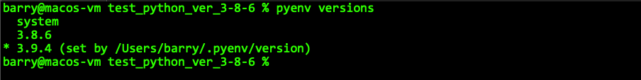

# Pyenv for MacOS
| [Home](README.md) | [Pyenv for MacOS](pyenv-for-macos.md) | [Pyenv for Linux](pyenv-for-linux.md) | [Pyenv for Windows](pyenv-for-windows.md) |

Like many things IT, there are multiple ways of doing the same thing and sometimes it just boils down to preference. There are multiple ways that you can install Pyenv on the MacOS (see [Pyenv’s repository](https://github.com/pyenv/pyenv) on Github for more install options. Here we are going to show how to install Pyenv using the package installer Homebrew. If you your Mac doesn’t have Homebrew installed or if you want to learn more about Homebrew see their [homepage](https://brew.sh/).

1. Before starting the installation to the pyenv first review this page Pyenv's [suggested build environment's page](https://github.com/pyenv/pyenv/wiki#suggested-build-environment) to ensure that your environment has the correct dependencies installed.
   
2. Verify that you have homebrew on your Mac. Open your terminal and for your Mac and type the following.
   
   `brew --version`

   

   If there is an error then you will probably need to install Homebrew on your machine. Visit their [homepage](https://brew.sh) for more information.

3. Next update Homebrew and then install the pyenv package.
   
   `brew update && brew install pyenv`

   Please be aware that brew may take a bit as it updates and install pyenv.

4. Once the installation has completed, then verify that that pyenv has been installed properly. You should see the latest version installed if you used the instructions from above.
   
   `pyenv --version`

   

5. Next to ensure that pyenv operates properly you will want to add the following to the **.zshrc** file. See the [Pyenv repository](https://github.com/pyenv/pyenv) for more information as there may be special exceptions.
   
   Use the command line editor of your choice (nano, vim, etc.) and then copy and paste the following where appropriate in the **.zshrc** file.
   <pre><code>
   # DEFINE ENVIRONMENTAL VARAILBLE TO POOINT TO THE PATH WHERE PYENV IS LOCATED
   # ADD THE $PYENV_ROOT/bin TO $PATH
   export PYENV_ROOT="$HOME/.pyenv"
   export PATH="$PYENV_ROOT/bin:$PATH"
   eval "$(pyenv init --path)"
   
   # ADD pyenv init TO YOUR SHELL TO ENABLE SHIMS AND AUTOCOMPLETION.
   if command -v pyenv 1>/dev/null 2>&1; then
      eval "$(pyenv init -)"
   fi
   </code></pre>

   Here you can see me update my ~/.zshrc with the `nano` editor.

   

6. Restart your shell to reload your shell profile to start with the new commands.
   
   `exec $SHELL`
   
   

7. Run the following command to view the available versions of python that you can install with pyenv.
   
   `pyenv install --list`

   
   
   **NOTE: OUTPUT IS TRUNCATED**

8. After you have chosen the version that you want to use then run pyenv install [version _number]. This will install that version. **Be aware that this may take a while so please be patient.**
   
   `pyenv install [version_number]`

   

9. Now that you have the version you want downloaded you can choose to set as your global version or system version. For example here we'll install version `3.9.4`.
   
   `pyenv global 3.9.4`

10. If you want to change to a different installed Python version by Pyenv, then simply change it by re-running the '`pyenv global [version_number]`' with the desired version number. Global will change the version of python for the entire environment. So regardless of where you are in the terminal you will be running the version configured by this command.
    
    
    
11. Pyenv will also allow you to set a Python version for a particular directory. When you use the '`pyenv local [version_number]`' command it will set the version for the current diectory and will only run within the directory. Once you leave the directory, you will go back to the global version or system version. Depending on what was set. **NOTE: This is not the same as a virtual environment, this just means when you leave that folder you’ll go back to the globally configured version.** 
   If you want the diretory to be set back to the global version, the use the '`pyenv local --unset`' command to set it back to the global version.

   
   
12. If you have more than one version of Python installed on your system by pyenv you can view it by running the following command. The asterisk represents the current version that is activation in your current location.

   