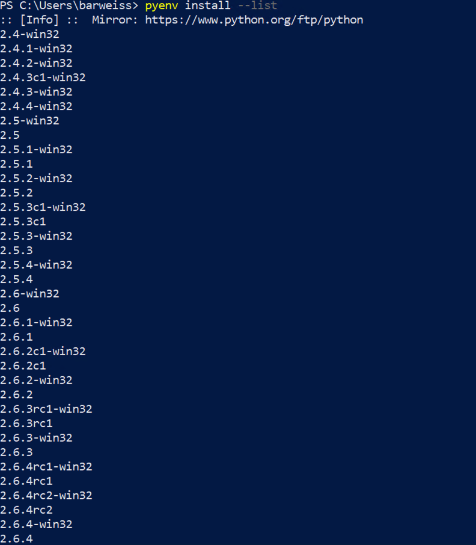

# Pyenv for Windows
| [Home](README.md) | [Pyenv for MacOS](pyenv-for-macos.md) | [Pyenv for Linux](pyenv-for-linux.md) | [Pyenv for Windows](pyenv-for-windows.md) |

Pyev-win, also known as pyenv for Windows, can be found in a repository at Github at [https://github.com/pyenv-win/pyenv-win](https://github.com/pyenv-win/pyenv-win). This is essentially a ported version of pyenv to Windows. There is a couple ways to install pyenv-win, however, I will just be demonstrating it through an existing installation of python and  pip. This scenario is similar to someone that already has Python installed on their PC and would like more control with Pyenv-win. See their repository for more information on other installation methods. I had the best success with this install using the Powershell terminal (at least when it comes to setting the environment variables).

1. First verify that pip is working properly. Use the command below, note the Python command used here. Although you can use the “pip --version” command, this will ensure that pip is installed and is aware of the desired version of Python that will be used.
   
    `python -m pip --version`

    

2. Once pip has been verified that it is working then use it to download pyenv-win.
   
   If you are using Powershell.
   
   `pip install pyenv-win --target $HOME\\.pyenv`
   
   If you are using cmd.exe
   
   `pip install pyenv-win --target %USERPROFILE%\.pyenv`

   **NOTE: Per the pyenv-win repository - “If you are running Windows 10 1905 or newer, you might need to disable the built-in Python launcher via Start > "Manage App Execution Aliases" and turning off the "App Installer" aliases for Python”**

3. You’ll want to use PowerShell for this part. You will not be able to run this in the cmd.exe terminal.

    ```
    [SYSTEM.ENVIRONMENT]::SETENVIRONMENTVARIABLE('PYENV',$ENV:USERPROFILE + "\.PYENV\PYENV-WIN\","USER")
    [SYSTEM.ENVIRONMENT]::SETENVIRONMENTVARIABLE('PYENV_HOME',$ENV:USERPROFILE + "\.PYENV\PYENV-WIN\","USER")
    ```
    Next add the following:
    ```
    [SYSTEM.ENVIRONMENT]::SETENVIRONMENTVARIABLE('PATH', $ENV:USERPROFILE + "\.PYENV\PYENV-WIN\BIN;" + $ENV:USERPROFILE + "\.PYENV\PYENV-WIN\SHIMS;" + [SYSTEM.ENVIRONMENT]::GETENVIRONMENTVARIABLE('PATH', "USER"),"USER")
    ```

4. Verify that pyenv-win is installed using the pyenv --version command. This should display the ported version of pyenv that you are running.
   
   `pyenv --version`

   

5. Run pyenv install --list to review all the available versions. The versions that are **without "-win32"** are the 64-bit versions.
    
    `pyenv install --list`

    

6. After you have chosen the version that you want to use then run `pyenv install [version _number]`. **NOTE: Be aware that this may take awhile so please be patient.**
   
   `pyenv install [version_number]`

   

7. Now that you have the version you want downloaded you can choose to set as your global version or system version.
   
   `pyenv global 3.9.4`

   

8. If you want to change to a different version that is installed by pyenv simply change it by re-running the pyenv global [version_number] with the desired version number. Global will change the version of python for the entire environment. So regardless of where you are in the terminal you will be running the version configured by this command.
   
   

9.  If you use the local command then essentially that version will run within the folder you are working on. NOTE: This is not the same as a virtual environment this just means when you leave that folder you’ll go back to the globally configured version.

    
