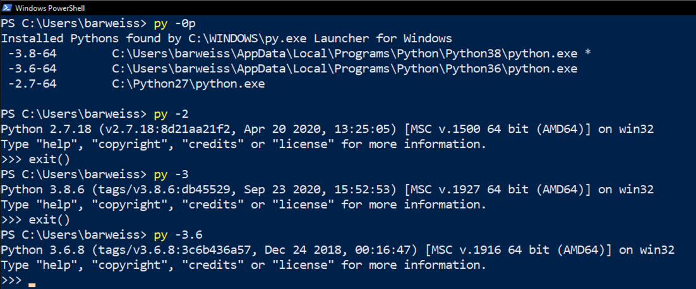

# The Windows Python Launcher
| [Home](README.md) | [Pyenv for MacOS](pyenv-for-macos.md) | [Pyenv for Linux](pyenv-for-linux.md) | [Pyenv for Windows](pyenv-for-windows.md) |

The Windows python Launcher, which is ran by using the “py” command (using “py --help” to view the documentation), is an excellent tool, but I have found it to be somewhat unwieldly and clunky. I have also had issues getting pip to work with the right Python version. This is where pyenv-win streamlines working with multiple versions of Python. 

Below shows the Windows Python Launcher in action. This application is available in Python version 3.3 and higher.

